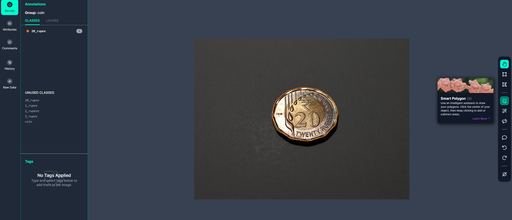
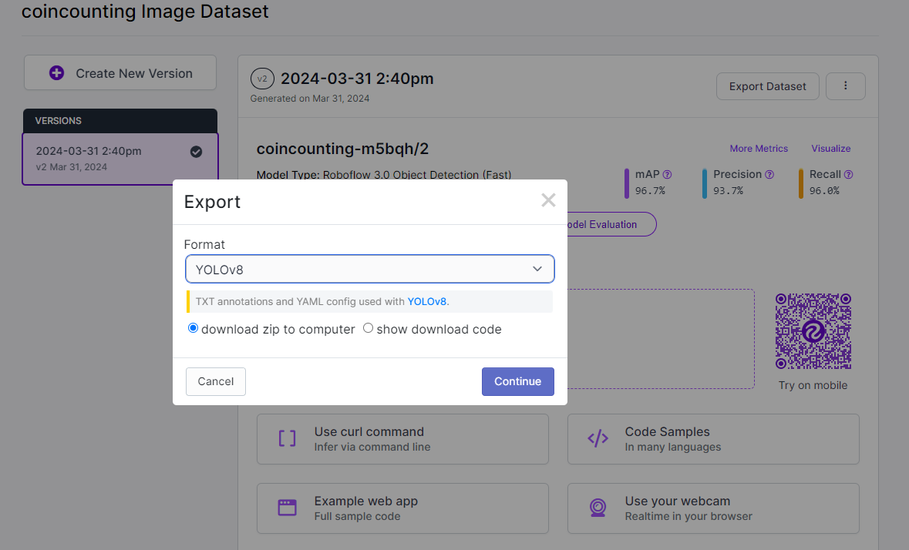
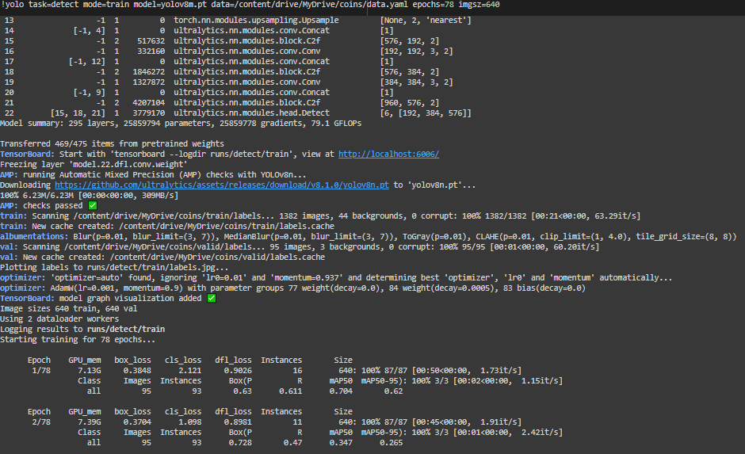
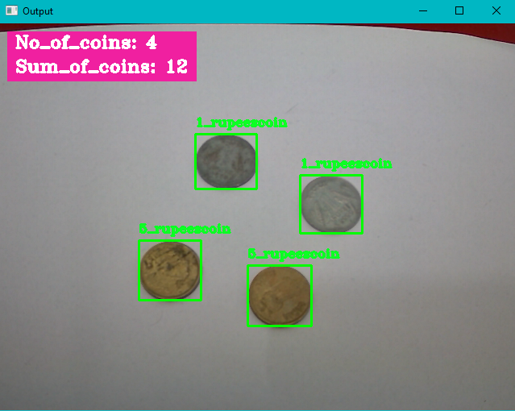

# Coin Detection and Counting Using YOLO and OpenCV
## Abstract
Counting coins manually is time-consuming and error-prone. Existing coin-counting machines often lack accuracy and versatility, necessitating the development of an automated coin-counter system using advanced image processing and computer vision. This project aims to address these challenges by leveraging the capabilities of YOLO (You Only Look Once) and OpenCV. By automating the coin-counting process, potential financial losses due to manual errors can be mitigated.

## Literature Survey
### Image Processing Based Systems and Techniques for the Recognition of Ancient and Modern Coins
Authors: Shatrughan M, Seema B
Published in International Journal of Computer Applications

### Prompt Indian Coin Recognition with Rotation Invariance Using Image Subtraction Technique
Authors: Gupta, V., Puri, R., Verma, M
Published in IEEE Explore

### Coin Detection and Recognition using Neural Networks
Authors: S.Mohamed, R.B. Jayanthi
Published in International Conference on Circuit, Power and Computing Technologies

### A Deep Learning approach for Indian Coin Recognition based on CNN-RNN
Authors: Sarika K, Madhavi G, Deepchanda C, Janvi S
Published in Journal of Emerging Technologies and Innovative Research

## Process
- Data Collection
- Annotation
- Generating Dataset
- Training
- Testing
- Deployment
## Data Collection
The dataset was obtained from Kaggle's Indian Coin Denomination Dataset (ICDD), comprising images of One (1), Two (2), Five (5), Ten (10), and Twenty (20) Rupee coins. In total, there are 30 different coins sampled, including 7 one rupee coins, 4 two rupee coins, 9 five rupee coins, 6 ten rupee coins, and 4 twenty rupee coins.

## Annotation

The data annotation process utilized Roboflow, a popular tool known for its accuracy and ease of use. Roboflow’s Smart Polygon tool facilitated the annotation process.

## Generation of Dataset

Following annotation, the dataset underwent preprocessing and augmentation using Roboflow's tools. The resultant dataset was exported in the YOLOv8 format.

## Training the Model

The model was trained using the YOLOv8 Medium model, offering both speed and accuracy. Training spanned 75 epochs, after which the 'best.pt' file was downloaded for inference.

## Testing

Initial testing yielded an accuracy range of 85-90%. Subsequent re-training led to higher accuracies.

## Deployment
The model was successfully deployed using a webcam, integrating features such as the number and sum of coins detected. Achieved accuracy ranged between 90-93%, with deployment requiring a white background environment.

## Future Implementation
Development of a Mobile Application
Enhancing accuracies for varied lighting scenarios and camera qualities
Expansion to accommodate coins from different countries and variations
